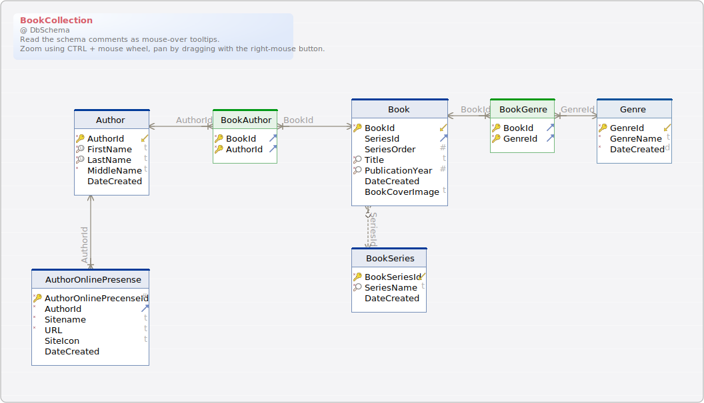

#BookCollection
Generated using [DbSchema](https://dbschema.com)

<a name='layout1'>### Parsed Script Layout

### Table Author 
Authors of books in collection

| Idx | Field Name | Data Type | Description |
|---|---|---|---|
| *🔑 ⬋ | <a name='dbo.Author_AuthorId'>AuthorId</a>| int  | Unique identifier for a specific author |
| *🔍 | <a name='dbo.Author_FirstName'>FirstName</a>| varchar&#40;30&#41;  | Author first name |
| *🔍 | <a name='dbo.Author_LastName'>LastName</a>| varchar&#40;60&#41;  | Author Last name |
| *| <a name='dbo.Author_MiddleName'>MiddleName</a>| varchar&#40;30&#41;  | Optional Author Middle name  &#40;IE Deanna K Dwyer&#41; |
|  | <a name='dbo.Author_DateCreated'>DateCreated</a>| datetime  DEFAULT getdate() | Date the record was added |
| Indexes |
| 🔑 | PK&#95;&#95;Author&#95;&#95;70DAFC34EFEA644D || ON AuthorId |  |
| 🔍  | UIX&#95;Author&#95;LastName&#95;FirstName || ON LastName&#44; FirstName |  |
| Options |
| ON &#91;PRIMARY&#93; |

### Table AuthorOnlinePresense 
| Idx | Field Name | Data Type | Description |
|---|---|---|---|
| *🔑 | <a name='dbo.AuthorOnlinePresense_AuthorOnlinePrecenseId'>AuthorOnlinePrecenseId</a>| int  | Uniquely identifies an online precense record |
| *⬈ | <a name='dbo.AuthorOnlinePresense_AuthorId'>AuthorId</a>| int  | identifies the author |
| *| <a name='dbo.AuthorOnlinePresense_Sitename'>Sitename</a>| varchar&#40;20&#41;  | Name of the site related to the author &#40;IE Twitter&#44; Facebook&#44; official website&#44; etc&#46;&#41; |
| *| <a name='dbo.AuthorOnlinePresense_URL'>URL</a>| varchar&#40;255&#41;  | URL for the site |
|  | <a name='dbo.AuthorOnlinePresense_SiteIcon'>SiteIcon</a>| varchar&#40;40&#41;  | Location of the icon to use for the Site |
|  | <a name='dbo.AuthorOnlinePresense_DateCreated'>DateCreated</a>| datetime  DEFAULT getdate() | Date the record was added |
| Indexes |
| 🔑 | PK&#95;&#95;AuthorOn&#95;&#95;19CAD89364C10C69 || ON AuthorOnlinePrecenseId |  |
| Foreign Keys |
|  | FK_Author_AuthorOnlinePrecense_AuthorId | ( AuthorId ) ref [dbo&#46;Author](#Author) (AuthorId) |  |
| Options |
| ON &#91;PRIMARY&#93; |

### Table Book 
Books in collection

| Idx | Field Name | Data Type | Description |
|---|---|---|---|
| *🔑 ⬋ | <a name='dbo.Book_BookId'>BookId</a>| int  | unique identifier for a specific publication of a book&#46; For example&#44; if you have teh first printing and second printing of a book&#44; those would be 2 seperate entries&#46; |
| ⬈ | <a name='dbo.Book_SeriesId'>SeriesId</a>| int  | If not null&#44; identifies teh series the book is part of |
|  | <a name='dbo.Book_SeriesOrder'>SeriesOrder</a>| tinyint  | Identifies the order the book falls in within the series |
| *🔎 | <a name='dbo.Book_Title'>Title</a>| varchar&#40;200&#41;  | title of the book |
| *🔎 | <a name='dbo.Book_PublicationYear'>PublicationYear</a>| smallint  | what year was the book published in |
|  | <a name='dbo.Book_DateCreated'>DateCreated</a>| datetime  DEFAULT getdate() | Date the record was added |
|  | <a name='dbo.Book_BookCoverImage'>BookCoverImage</a>| varchar&#40;255&#41;  | file location of the book cover image |
| Indexes |
| 🔑 | PK&#95;&#95;Book&#95;&#95;3DE0C2073799403A || ON BookId |  |
| 🔎  | IX&#95;Book&#95;Title || ON Title |  |
| 🔎  | IX&#95;Book&#95;PublicationYear || ON PublicationYear |  |
| Foreign Keys |
|  | FK_Book_BookSeries_BookSeriesId | ( SeriesId ) ref [dbo&#46;BookSeries](#BookSeries) (BookSeriesId) |  |
| Options |
| ON &#91;PRIMARY&#93; |

### Table BookAuthor 
This table will link one or more authors to a book&#46; This will handle collaborations such as Stephen King and Peter Straub&#39;s The Talisman

| Idx | Field Name | Data Type | Description |
|---|---|---|---|
| *🔑 ⬈ | <a name='dbo.BookAuthor_BookId'>BookId</a>| int  | Identifies the book |
| *🔑 ⬈ | <a name='dbo.BookAuthor_AuthorId'>AuthorId</a>| int  | Identifies the author |
| Indexes |
| 🔑 | PK&#95;BookAuthor || ON BookId&#44; AuthorId |  |
| Foreign Keys |
|  | fk_BookAuthor_Book_BookId | ( BookId ) ref [dbo&#46;Book](#Book) (BookId) |  |
|  | fk_BookAuthor_Author_AuthorId | ( AuthorId ) ref [dbo&#46;Author](#Author) (AuthorId) |  |

### Table BookGenre 
Links Book to Genre&#40;s&#41;

| Idx | Field Name | Data Type | Description |
|---|---|---|---|
| *🔑 ⬈ | <a name='dbo.BookGenre_BookId'>BookId</a>| int  | udentifies book for genre |
| *🔑 ⬈ | <a name='dbo.BookGenre_GenreId'>GenreId</a>| tinyint  | Identifies genre for the book |
| Indexes |
| 🔑 | PK&#95;BookGenre || ON BookId&#44; GenreId |  |
| Foreign Keys |
|  | fk_BookGenre_Book_BookId | ( BookId ) ref [dbo&#46;Book](#Book) (BookId) |  |
|  | fk_BookGenre_Genre_GenreId | ( GenreId ) ref [dbo&#46;Genre](#Genre) (GenreId) |  |

### Table BookSeries 
| Idx | Field Name | Data Type | Description |
|---|---|---|---|
| *🔑 ⬋ | <a name='dbo.BookSeries_BookSeriesId'>BookSeriesId</a>| int  | Identifies a series within the system |
| *🔎 | <a name='dbo.BookSeries_SeriesName'>SeriesName</a>| varchar&#40;100&#41;  | Name of the book series |
|  | <a name='dbo.BookSeries_DateCreated'>DateCreated</a>| datetime  DEFAULT getdate() | Date the record was added |
| Indexes |
| 🔑 | PK&#95;&#95;BookSeri&#95;&#95;400186356576C63F || ON BookSeriesId |  |
| 🔎  | IX&#95;BookSeries&#95;SeriesName || ON SeriesName |  |
| Options |
| ON &#91;PRIMARY&#93; |

### Table Genre 
Possible genres for the books

| Idx | Field Name | Data Type | Description |
|---|---|---|---|
| *🔑 ⬋ | <a name='dbo.Genre_GenreId'>GenreId</a>| tinyint  | Uniquely identifies a genre within the system |
| *| <a name='dbo.Genre_GenreName'>GenreName</a>| varchar&#40;100&#41;  | Name of the genre |
| *| <a name='dbo.Genre_DateCreated'>DateCreated</a>| date  DEFAULT getdate() | Date the record was added |
| Indexes |
| 🔑 | pk&#95;Genre || ON GenreId |  |

